Exploratory Data Analysis in R for Prosper Loans dataset
================
Kevin Ivan Kosacoff
18-02-2019

Prosper is a website that connects borrowers and lenders directly. There
are no financial intermediaries. Each borrower gets a rating with a
letter that tells the risk of that loan. With AA being the highest
rating and HR (High Risk) being the worst type of rating. Also we can
see there are some other variables of interest such as the APR on that
loan, the amount or the category. This data set contains 113,937 loans
with 81 variables on each loan, including loan amount, borrower rate (or
interest rate), current loan status, borrower income, borrower
employment status, borrower credit history, and the latest payment
information. I’ll try to analyze and summarize all this information
using R.

# Univariate and Bivariate Plots Section

We will start by analyzing some key variables when taking a loan like
borrower APR, principal amount, credit score, loan status and more.

1st, let’s look at how the borrower annual percentage rate is
distributed across all loans. This tell us how expensive it is to seek
funding in
Prosper.

Hm… interesting, we see that the distribution spikes at about 0.21 but
then spikes 2 more times at 0.3 and 0.36. It’d be interesting to analyze
why this happens.

We can see below how the borrower’s APR distributes across Credit
Rating, which determines the risk level of the borrower. As this risk
level decreases (score goes up closer to AA) the rate at which the
borrower finances seems to decrease. This seems to explain why we see
the spike in the total distribution of the APR. Contrary case, as the
credit rating score decreases, interest rate goes
up.

We can really appreciate in the above graph how the APR raises as Credit
Rating gets lower. Below is the distribution for each rating

    ## ld$CreditRating: AA
    ##    Min. 1st Qu.  Median    Mean 3rd Qu.    Max. 
    ## 0.01650 0.08325 0.09142 0.09645 0.10140 0.33172 
    ## ------------------------------------------------------------ 
    ## ld$CreditRating: A
    ##    Min. 1st Qu.  Median    Mean 3rd Qu.    Max. 
    ## 0.01315 0.12461 0.13734 0.13841 0.15077 0.36623 
    ## ------------------------------------------------------------ 
    ## ld$CreditRating: B
    ##    Min. 1st Qu.  Median    Mean 3rd Qu.    Max. 
    ## 0.01325 0.16653 0.17754 0.17985 0.19501 0.37633 
    ## ------------------------------------------------------------ 
    ## ld$CreditRating: C
    ##    Min. 1st Qu.  Median    Mean 3rd Qu.    Max. 
    ## 0.00653 0.20040 0.22108 0.21866 0.24205 0.40243 
    ## ------------------------------------------------------------ 
    ## ld$CreditRating: D
    ##    Min. 1st Qu.  Median    Mean 3rd Qu.    Max. 
    ## 0.00653 0.24614 0.27467 0.26626 0.29510 0.41355 
    ## ------------------------------------------------------------ 
    ## ld$CreditRating: E
    ##    Min. 1st Qu.  Median    Mean 3rd Qu.    Max. 
    ## 0.01657 0.30131 0.32446 0.31589 0.34621 0.41355 
    ## ------------------------------------------------------------ 
    ## ld$CreditRating: HR
    ##    Min. 1st Qu.  Median    Mean 3rd Qu.    Max. 
    ## 0.00864 0.30564 0.35643 0.32794 0.35797 0.42395

Let’s move on to analyze how much money borrowers request when asking
for a loan on Prosper.

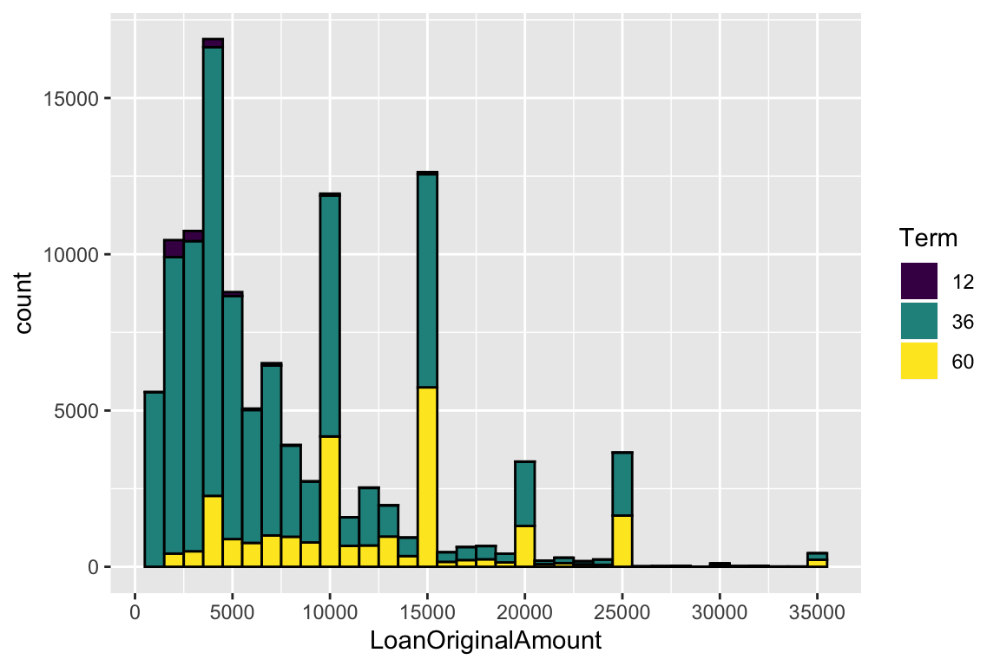

We see most loans are below $ 5,000, although we see other spikes in the
$10,000s and the $ 15,000s. This may be related to the psychological
factor of being $ 5,000 multiples, and people like this kind of numbers,
and they don’t request the exact amount they need, but round up to a
5000
multiple.

On the above graph, we’ve faceted the borrowed amount by category. We
can see that the categories that borrows the biggest amount are Debt
Consolidation, Home Improvement and Business.

Moving on, let’s see how the term of the loans distribute. It’s
interesting to see for how much time borrowers will need the money.

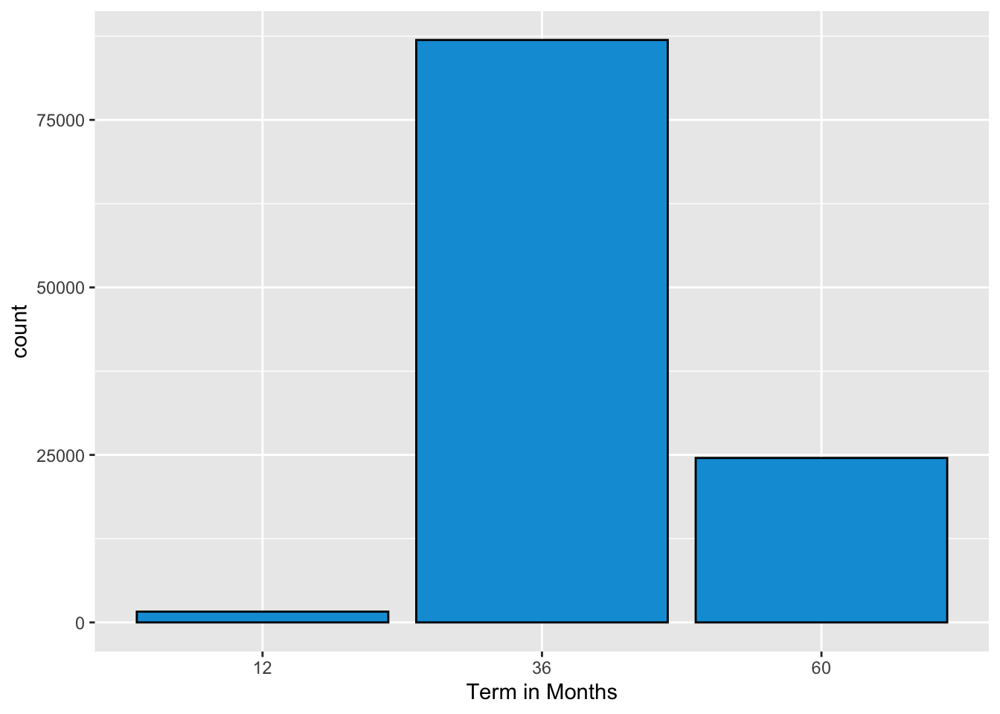

So we can see above that only 3 term values appear, this may be due to a
limitation of Prosper to only offer 3 terms when borrowing a loan. We
also see that the value that appears the most is the 36 months term (3
years) The max value is 60 months (5 years), the minimum 12 months (1
year).

Let’s continue with analyzing the Credit Score distribution of each
borrower, this may tell us if people with bad credit score use Prosper
more than people with good credit
score.

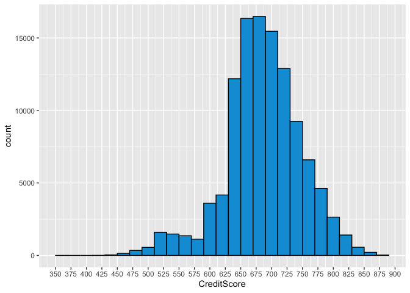

We see that the credit score follows a pretty normal distribution with
most values in the 650-700 range. Although we see some outliers
especially in the low end. We can also see a small spike in the 500-550
range.

Let’s now analyze the stated monthly income of the
borrowers.

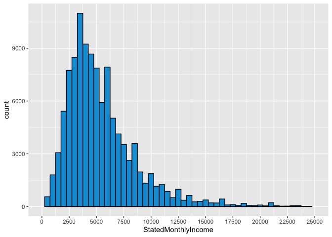

We can see from the above graph that the distribution is right-skewed as
most of the values are at the left and we see less extreme values to the
right. This makes sense as we don’t expect that people with a lot of
income to have the need to borrow money.

Let’s now see what’s the average monthly loan
payment.

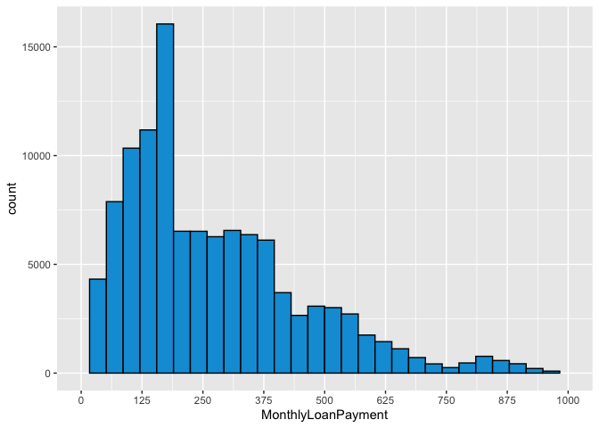

We can see above how much it is paid per month on each of the loans, we
see the distribution really spikes in the $150 monthly payment.

Based on both variables looked above, let’s move on now to, what I
believe it is one of the most important variables when analyzing if you
should give a loan to someone. The Debt Income Ratio calculates how much
of debt services you have to pay each month, divided by your monthly
income, as it is closer to one, the more indebted you are and the more
difficulties you are going to have when repaying a loan. Let’s see how
this variable distributes across our
dataset.

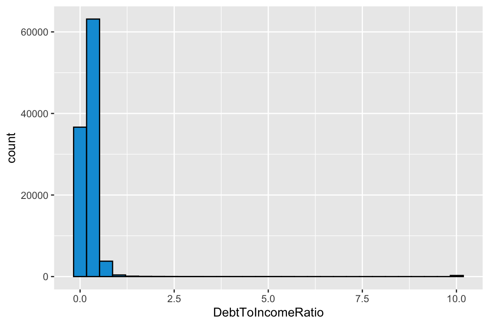

So we see a very extreme value of almost 10 in the far right. This value
makes no sense as it means someone pays 10 times per month of their
monthly income\! Let’s limit the graph so we see the distrbution of the
left-sided values. We can also see that most values are below one, which
makes total sense as it is very difficult for someone to survive paying
each month more of what it
earns.

Now we can see a nice distribution of the debt to income ratio, with
most values in the 0.15-0.20 range, which also makes sense as it is
normal that someone spends 15-20% of their income in servicing their
debts.

Let’s take the analysis even further and see if there is any difference
on the ratio based on Credit
Rating.

Let’s look now at the time it takes to get a loan from the date you
create a listing.

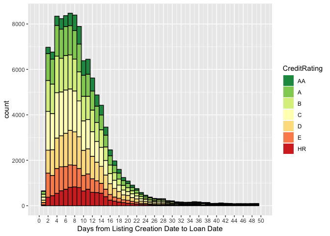

We can see in the graph above that most listings get a loan in 3 to 10
days. We see that the distribution is right-skewed as most values are to
the left of the distribution, with more extreme values to the right. It
looks that you can get a loan pretty fast in Prosper, with exception of
some cases. And also it is filled with the Credit Rating and it seems
the Credit Rating doesn’t have an impact in how fast you can get a loan.

Let’s move on now to some categorical variables. Let’s start with the
Credit Rating. We can see below how the borrwoers distribute accross
Credit Rating. We see most of them tend to have a medium credit rating
(C) and more extreme values (AA and HR) are
rarer.

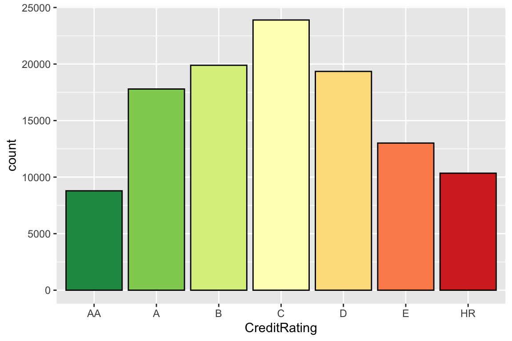

Let’s look at the distribution of Credit Ratings by Category.

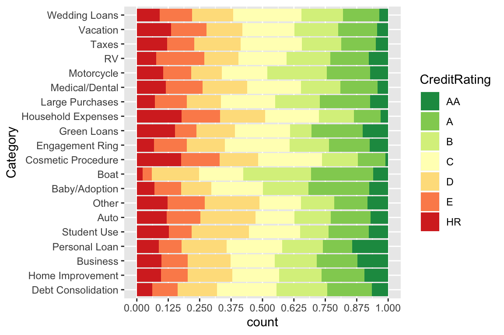

It’s interesting to see that the borrowers that ask for a loan for
Cosmetic Procedures are rated as HR. On the other side, most of the
borrowers in Category Boat are high-rated.

Let’s go with another categorical variable like the states of the
borrowers, so we can see the distribution across
states.

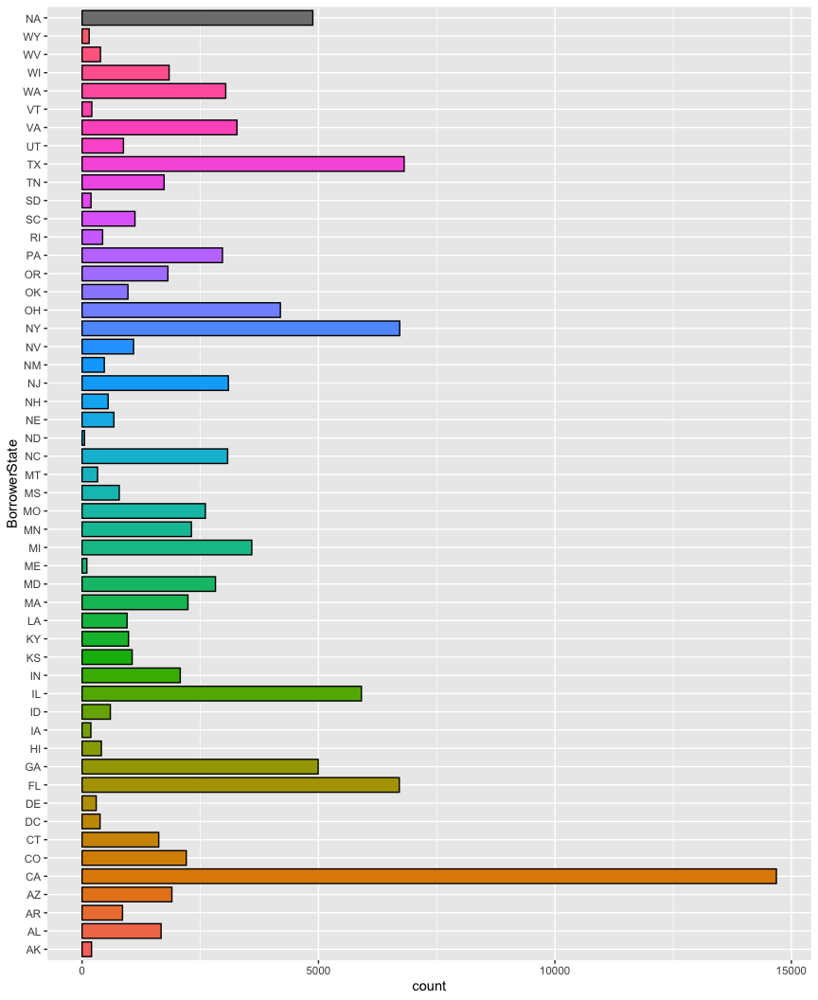

We can see from the above that the borrowers are mainly from California,
Florida, Texas and New York. This may have to do with the amount of
population in each of these states, as these 4 states account for 30% of
the total of US population.

Let’s now look at the Loan Status of each
loan.

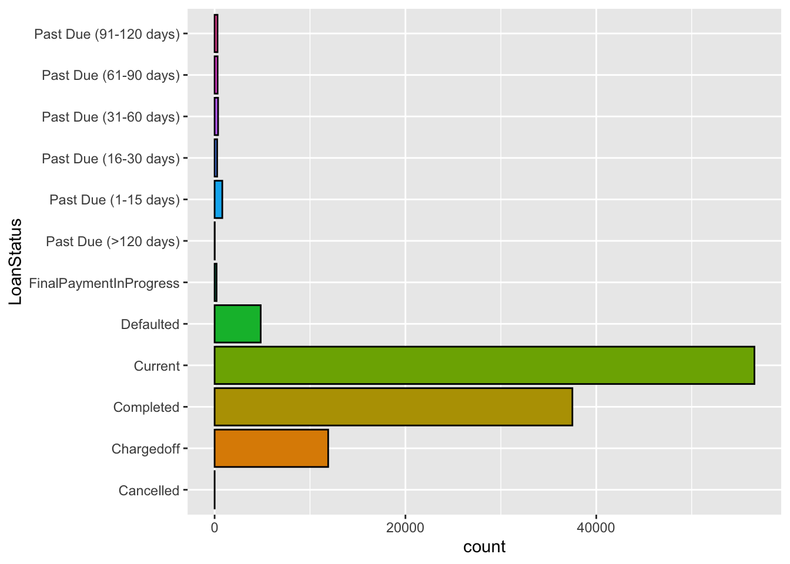

We can see most loans are active (current), then completed and lastly
charged off. We see a small amount of loans are past
due.

<!-- # Univariate Analysis -->

<!-- ### What is the structure of your dataset? -->

<!--  The original dataset contains 113937 obs. of  81 variables. Each observation -->

<!-- is a loan someone obtained via Prosper's website -->

<!-- ### What is/are the main feature(s) of interest in your dataset? -->

<!--  I believe the main features to analyze are: the APR on the loan, the principal, -->

<!-- the term and the credit grade of the borrower. -->

<!-- ### What other features in the dataset do you think will help support your investigation into your feature(s) of interest? -->

<!--  The income of the borrower, the monthly loan payment and the occupation. -->

<!-- ### Did you create any new variables from existing variables in the dataset? -->

<!--  Yes, I created a new variable that merges the credit grade from pre-2009 -->

<!-- listings with the post-2009 so we can have all the info in one column. I also -->

<!-- created a new column of the Listing Category with the name instead of a number. -->

<!-- ### Of the features you investigated, were there any unusual distributions? Did you perform any operations on the data to tidy, adjust, or change the form of the data? If so, why did you do this? -->

<!--  I've changed the format of the date variables in order to be able to make -->

<!-- operations with them like the Listing Creation Date or the Closing Date. -->

## Quantitative vs Quantitative

Let’s start with looking at the relationship with Credit Score and
Borrower’s APR.

    ## 
    ##  Pearson's product-moment correlation
    ## 
    ## data:  ld$CreditScore and ld$BorrowerAPR
    ## t = -172.37, df = 113080, p-value < 2.2e-16
    ## alternative hypothesis: true correlation is not equal to 0
    ## 95 percent confidence interval:
    ##  -0.4607567 -0.4515253
    ## sample estimates:
    ##        cor 
    ## -0.4561533

We can see from the above graph that there seems to be a negative medium
correlation between the credit score of the borrower and the APR it is
charged for the loan. This is, as the credit score increases, the lower
the borrower will be charged for the loan. This is only based on the
correlation but remember that correlation does not mean causation. I’ve
also added transparency to the points so that we can see were most of
the values concentrate. Also the Y axis was log-transformed so we can
more clearly see the change in the APR as the Credit Score increases.

Let’s now look to at the relationship between credit score and the
principal amount
borrowed.

    ## 
    ##  Pearson's product-moment correlation
    ## 
    ## data:  ld$CreditScore and ld$LoanOriginalAmount
    ## t = 126.67, df = 113080, p-value < 2.2e-16
    ## alternative hypothesis: true correlation is not equal to 0
    ## 95 percent confidence interval:
    ##  0.3473921 0.3576005
    ## sample estimates:
    ##       cor 
    ## 0.3525068

So at 1st sight we can see some kind of increase in the amount lended as
the credit score increases. Let’s transform the y-axis to see if we get
a more clear relation. We also see these horizontal bars in the $5,000
multiples, which goes in line with what we saw in the histogram of the
Loan Amount, where people usually borrows these amounts due to a
psychological factor of the
number.

We can see a weak relationship between these 2 variables with a lot of
spread, but this has to do mainly with that a borrower with a high
credit score does not necesarily asks for a high amount of principal.
Anyway, we can see that borrowers with low credit score have no loans
with high principal.

## Qualitative vs Quantitative

Let’s now move to some relationships between qualitative and
quantitative variables. Let’s start with seeing the relationship between
credit rating and borrower’s APR. We’ve already peaked this relationship
on the histogram of the APR, filled by Credit Rating. And above looking
the relation between Credit Score and APR.

So it can be cleary see from the above graph that as the credit rating
gets worse, the APR for the loan is higher. We can see a lot of outliers
anyway for both extremes (AA and HR). We also see how the IQR increases
as the rating gets worse, this may be due to a factor of “luck” in
getting a better rate for worst rated borrowers. We’ve added alpha to
the outliers to show that they are not the norm and are rather unusual.

Let’s take the above further and divide also by the term of the
loan.

We can see that for the best ratings as the term of the loan increases,
so does the rate. This has to do with the risk of lending to longer
terms, mainly the risk of interest rates rising. The same doesn’t apply
very much to lower rated borrowers.

let’s now look at the relationship between Credit Rating and Monthly
Income.

We can see that the monthly income tends to decrease together with the
rating. This has makes sense as it could be that lower income people,
struggle more with debt, which lowers their rating.

Let’s continue with the credit rating and now let’s compare it to the
amount
borrowed.

Very interesting graph. We clearly see a difference in the amount
borrowed by lower rating people. Could this be due to an aversion from
the lenders to lend to bad rated borrowers, or a precaution from the
borrower to not ask for something he/she won’t be able to repay. It’s
also clearly seen how until rating C the IQR are quite wide and reaches
an amount of almost 15,000, but then that values decreases
significantly, together with the rating.

The next one is pretty obvious but it’s worth seeing it anyway. It shows
the relationship between credit rating and credit score.

So the above graph is what we expected to see. A lower credit score is
related with a lower rating. It is worth noting the IQR of the HR
Rating, it is much wider than the other ratings, and even the median is
higher than E rating, which is weird.

Let’s try to see where does the bad rating comes from. To do that we are
now seeing the Credit Rating vs Delinquencies in Last 7
years.

And voila. Here is from where the bad rating comes from. We can cleary
appreciate how for the best rated borrowers the IQR is almost null (no
delinquencies), but as we get down the rating, we see the the IQR starts
to increase and we see it is more normal for lowest rated borrowers to
have at least 1 delinquency in the last 7 years.

Let’s continue with analyzing the differences between the ratings. Now
its the turn of the total enquiries.

So based on the above graph we can see that inquiries increase as rating
gets worse. This may be related to the fact that people that got to a
bad credit rating in the 1st place was because of little or none
personal finance education, so that’s why more inquiries are made.
That’s why so important to have a solid base in personal finance
education.

I think it was enough of the Credit Rating variable. Let’s now move on
to see some information about the Loan
Categories.

We can see from the above that some categories have a lot of variability
in the amount borrowed, such as Debt Consolidation, Baby/Adoption and
Wedding Loans. Also the category with the highest median is Debt
Consolidation with a value of almost 10,000. In the other extreme we
have the lower variability categories, such as Student Use, Personal
Loans and Household expenses. With the Student category having a median
value of about
2,500.

<!-- ### Talk about some of the relationships you observed in this part of the investigation. How did the feature(s) of interest vary with other features in the dataset? -->

<!--  Credit rating or credit score are the main factors for the changes in the APR. -->

<!-- Also, Credit Rating affects the amount loaned. -->

<!-- ### Did you observe any interesting relationships between the other features (not the main feature(s) of interest)? -->

<!--  I found some relationship between the credit rating and the amount of enquiries -->

<!-- and the total delinquencies in last 7 years. And I've explained that there is -->

<!-- a relationship between those 2 variables and the rating. -->

<!-- ### What was the strongest relationship you found? -->

<!--   The strongest correlation I found was between Borrower APR and Credit Score, -->

<!-- a coeficient of -0.46. Which means that as credit score was higher, APR went down. -->

<!-- As the risk of default was lower. -->

# Multivariate Plots Section

<!--   **Tip**: Now it's time to put everything together. Based on what you found in -->

<!-- the bivariate plots section, create a few multivariate plots to investigate -->

<!-- more complex interactions between variables. Make sure that the plots that you -->

<!-- create here are justified by the plots you explored in the previous section. If -->

<!-- you plan on creating any mathematical models, this is the section where you -->

<!-- will do that. -->

Let’s now plot together our main variables, APR, Principal and the
Rating.

The above graph confirms what we’ve been seeing before. As The lowest
APRs are for the highest rated borrowers (dark green strip) and as
rating gets worst, so does the APR. It is also interesting to see that
the loan amounts are also affected by the rating. The loans of $ 30,000
or more only go to borrowers with at least B
rating.

<!-- # Multivariate Analysis -->

<!-- ### Talk about some of the relationships you observed in this part of the investigation. Were there features that strengthened each other in terms of looking at your feature(s) of interest? -->

<!--  In this last part we mainly confimed what we've been seeing in the other -->

<!-- analysis. By adding a 3rd variable we were able to see the whole picture of -->

<!-- the loans, its APR and the rating of the borrower. -->

<!-- ### Were there any interesting or surprising interactions between features? -->

<!--  Not really, based on what I've been seeing the analysis made sense. -->

-----

# Final Plots and Summary

<!--   **Tip**: You've done a lot of exploration and have built up an understanding -->

<!-- of the structure of and relationships between the variables in your dataset. -->

<!-- Here, you will select three plots from all of your previous exploration to -->

<!-- present here as a summary of some of your most interesting findings. Make sure -->

<!-- that you have refined your selected plots for good titling, axis labels (with -->

<!-- units), and good aesthetic choices (e.g. color, transparency). After each plot, -->

<!-- make sure you justify why you chose each plot by describing what it shows. -->

### Plot One

### Description One

The above graph is a simple histogram, but adding the coloring by Credit
Rating gives us so much information. It is our start of the exploration
of how this variables, APR and Rating, affect a loan. It is clearly seen
how the distribution changes together with the Rating. We can see that
worst rated borrowers are more to the right side of the graphic as that
means a higher APR, due to the increased risk.

### Plot Two

### Description Two

The above was surprising for me as it is clearly seen how lowest rated
borrwers don’t get big loans, instead the loan is well below the 5,000
limit. It is interesting to investigate if this is an aversion from
lenders to borrow high- risk borrowers. Or a precaution from borrowers
to not ask more than they are capable of repaying.

### Plot Three

### Description Three

For the last graph I chose one that merges the above 2 and let us see
the whole picture. We can see these colores “strips” across the graph,
that divide the borrwers based on its credit rating. As these strips go
higher the APR increases, so it is no surprise that HR category is at
the top. We can also see some kind of vertical strips across the amount
loaned in the $5,000 multiples. And also how only high rating borrowers
are given big loans.

-----

# Reflection

I was very interested in finding what made the different APRs for the
loans. And I was not surprised to find out that these loans follow one
of the most basic finance principles, as risk increases so does return,
which in this case is expressed with the APR. One of main struggles I
had was dealing with so many variables and knowing which one were useful
and which ones not. Overall it is a very interesting data set, for which
I wish I have more time to investigate it more thoroughly. It would be
interesting to analyze the evolution of loans over time and how the APR
varies together with US Fed rates.
